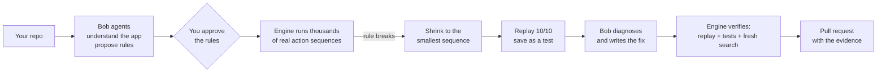

# Rook

**Find the smallest sequence that breaks your software, before your users do.**

Rook reads your repository, works out the business rules your app must never break, and then **actually tries to break them**. When it succeeds, you don't get a vague warning. You get the **shortest exact sequence of actions** that breaks the rule, replayed on your real app as proof. Then IBM Bob fixes it, and Rook proves the fix.

```
✗ RULE BROKEN   Total refunds never exceed the amount paid

  1. buy(mug, ₹100)
  2. refund(₹60)
  3. refund(₹50)

  Paid ₹100    Refunded ₹110    ✗
  Replayed 10 / 10 on the real app ✓ real bug
```

> **Bob finds the rules. The engine tries to break them. Proof decides.**

Built for the **IBM Bob 2.0 Hackathon** (lablab.ai, Sep 2026).

**Try it in the browser: <https://rook-weld-six.vercel.app>** (guest demo, no sign-in needed).

🚧 **Status: in active development during the hackathon.** See [`STATUS.md`](STATUS.md) for live progress.

---

## Why

Developers test the scenarios they think of. Each test passes. Real, expensive bugs (double refunds, negative stock, permission bypasses, subscriptions that keep charging) come from **unexpected sequences of valid actions** that nobody wrote a test for.

AI code review says *"this might have a bug"*. That's a guess. Rook gives you **proof**.

| | Unit tests | Fuzzing | AI code review | **Rook** |
|---|---|---|---|---|
| Finds scenarios you didn't think of | ✗ | ✓ | ~ | ✓ |
| Understands business rules | ✗ | ✗ | ✓ | ✓ |
| Real, reproducible proof | ✓ | ✓ | ✗ | ✓ |
| Minimal reproduction | ✗ | ~ | ✗ | ✓ |
| Fixes and verifies the fix | ✗ | ✗ | ~ | ✓ |

## How it works



1. **Understand.** Bob agents read your code, start your app in a sandbox and map its API into actions.
2. **Rules.** Bob proposes the rules that must always hold (for example "refunds never exceed payment"), with evidence from your code. A reviewer agent challenges them, and **you approve**.
3. **Break.** The deterministic engine runs thousands of valid action sequences against your **real running app** and checks every rule after every step.
4. **Shrink.** A failure 12 steps long becomes the **3 steps that matter**.
5. **Prove.** It replays the steps on the real app (10/10) and saves them as a permanent regression test.
6. **Fix.** Bob finds the root cause and writes the fix, and a reviewer agent checks it.
7. **Verify.** The exact replay, your test suite and a fresh search must all pass. Then a PR opens with the evidence.

**Bob thinks, the engine proves.** An LLM never decides whether something passed or failed.

## Meet the team

Rook uses **13 IBM Bob agents** (a Coordinator plus 12 specialists) (Bob custom modes), each with one focused job. They appear in your terminal as little characters while they work.

| | Agent | Job |
|---|---|---|
| 🟡 | Coordinator | Plans the run and decides the next step (within hard rails) |
| 🟢 | Scout | Understands the repository |
| 🟠 | Mechanic | Gets the app running in a sandbox |
| 🔵 | Mapper | Turns endpoints into actions |
| 🟣 | Lawmaker | Proposes the business rules |
| 🔺 | Rule Critic | Challenges the rules |
| 🟥 | Test Designer | Designs targeted scenarios |
| 🟤 | Strategist | Points the search at risky areas |
| 🔷 | Detective | Finds the root cause |
| 🔺 | Diagnosis Reviewer | Checks the diagnosis against the evidence |
| 💚 | Surgeon | Writes the fix (the only agent allowed to edit code) |
| 🔺 | Fix Reviewer | Checks the fix |
| ⚪ | Guide | Answers your questions while Rook works |

And **6 engine workers**, with no AI, that do the proving: **Runner · Judge · Shrinker · Replayer · Test Runner · Verifier**.

## Quick start

> Available once the first release is published. See [`STATUS.md`](STATUS.md).

```bash
uv tool install rook-cli      # or: pipx install rook-cli
rook                          # sign in, connect GitHub, then just say "find bugs in my app"
```

Requirements: Python 3.12+, Docker, and [IBM Bob Shell](https://bob.ibm.com/docs/shell) with `BOB_API_KEY` set.

Commands:

```bash
rook                      # interactive session (the main experience)
rook run --ci             # non-interactive; exit code 1 if a rule breaks (for CI)
rook replay <cx-id>       # replay a counterexample on your app
rook explain <cx-id>      # ask Bob why it broke
rook verify <cx-id>       # prove a fix
```

**Web app:** the same experience in the browser at <https://rook-weld-six.vercel.app>. Try the demo repos without signing in.

## GitHub Action

Rook can check every pull request: the action runs `rook run --ci --auto`, posts `rook-report.md` as a
single PR comment (updated on each push, never duplicated) and fails the job when an approved rule is
broken (exit 1) or the run does not finish (exit 2). The comment is posted before the job fails.

```yaml
# .github/workflows/rook.yml
name: rook
on:
  pull_request:          # not pull_request_target: see "Forks and secrets" below
permissions:
  contents: read
  pull-requests: write   # to post the Rook comment
jobs:
  rook:
    runs-on: ubuntu-latest
    steps:
      - uses: actions/checkout@11bd71901bbe5b1630ceea73d27597364c9af683 # v4.2.2
        with:
          persist-credentials: false
      - uses: tony19053000/rook@<full-commit-sha>   # pin Rook to a commit SHA too
        with:
          bob-mode: live                              # falls back to replay when the key is missing
          bob-api-key: ${{ secrets.BOB_API_KEY }}
          bob-package: https://example.com/bobshell-2.0.5.tgz   # where you host the Bob Shell package
          recordings: rook/recordings                 # used in replay mode (0 Bobcoins)
```

Inputs: `repo-path` (default `.`), `request`, `bob-mode` (`replay` | `live`, default `replay`),
`bob-api-key`, `bob-package`, `recordings`, `auto` (default `true`), `budget`, `seconds`, `setup`
(space-separated env var names your app needs, set with `env:` on the step), `report-dir`, `comment`
(default `true`) and `github-token` (default `github.token`). Outputs: `exit-code`, `report`, `bob-mode`.

**Forks and secrets.** Use the `pull_request` trigger. A PR from a fork gets no secrets and a read-only
token, so the action uses recorded Bob instead of live Bob and cannot comment (it warns; the report is
still in the job summary). **Never use `pull_request_target` with this action**: it runs with your
secrets on the base repo while the checked-out code can come from the fork, which would hand your
`BOB_API_KEY` to anyone who opens a PR. The key is masked in logs and given only to the Rook step.

Try the comment step without GitHub (it prints the exact API requests, with the token redacted):

```bash
rook-pr-comment --dry-run --report rook-report.md \
  --event tests/fixtures/github_action/pull_request.json --event-name pull_request
```

## What gets added to your repo

```
rook/rook.yaml                    # the actions, state and rules you approved
rook/counterexamples/cx_001.json  # every counterexample, replayable forever
tests/rook_cx_001.test.js         # a native regression test (in your language)
```

## Works with

Any backend with an **HTTP API**, in any language, because Rook talks to your running app over HTTP. The demo apps use Node.js, Python and Go.

## Architecture and docs

| Doc | What's inside |
|---|---|
| [`docs/01_PRD.md`](docs/01_PRD.md) | Product requirements |
| [`docs/02_ARCHITECTURE.md`](docs/02_ARCHITECTURE.md) | Architecture, contracts, engine design |
| [`docs/03_SECURITY_ACCESS.md`](docs/03_SECURITY_ACCESS.md) | Security and access model |
| [`docs/04_FRONTEND_SPEC.md`](docs/04_FRONTEND_SPEC.md) | CLI and web UI spec |
| [`docs/05_FEATURE_TICKETS.md`](docs/05_FEATURE_TICKETS.md) | Tickets and roadmap |
| [`STATUS.md`](STATUS.md) · [`HANDOFF.md`](HANDOFF.md) | Live progress and session handoff |

**Stack:** Python (engine, agents, API, Textual CLI) · Next.js (web) · IBM Bob Shell · SQLite · Docker · Supabase Auth · GitHub App · Vercel + AWS EC2 (Docker Compose, Caddy).

## How IBM Bob is used

- **In the product:** 13 Bob custom modes, called through `bob run --format stream-json`, with per-agent tool permissions (only the Surgeon can edit, and only the files it was approved to edit). Every step Bob takes streams live into the UI.
- **In building it:** Bob IDE was used during development (see the demo video).

## Roadmap

A GitHub App that checks every pull request · verifying code written by AI coding agents · enterprise policy rules ("support never reads payroll", "no cross-tenant access") · continuous invariant testing.

## License

MIT
