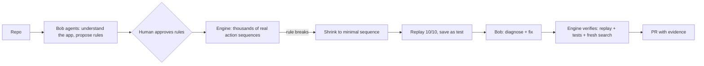

# Rook

**IBM Bob-powered agents that find your app's business rules, break them with a minimal counterexample, fix the bug and prove the fix. Only the deterministic engine decides pass or fail.**

| | |
|---|---|
| Web app (guest demo, no sign-in) | <https://rook-weld-six.vercel.app> |
| API | <https://44-239-185-88.sslip.io> |
| Demo video | `<VIDEO_URL>` |
| Slide deck | `<DECK_URL>` |

Built for the **IBM Bob 2.0 Hackathon** (lablab.ai, Sep 2026). MIT licensed.

```
✗ RULE BROKEN   Total refunds never exceed the amount paid

  1. buy(mug, ₹100)
  2. refund(₹60)
  3. refund(₹50)

  Paid ₹100    Refunded ₹110    ✗
  Replayed 10 / 10 on the real app ✓ real bug
```

## The problem

Unit tests cover the scenarios you thought of. Costly bugs like double refunds, negative stock and permission bypasses come from **unexpected sequences of valid actions**. An AI reviewer that says "this might have a bug" is only guessing. Rook runs the failing sequence on your app and shows you the result.

## Try it in 30 seconds

1. Open <https://rook-weld-six.vercel.app> and click **Try the demo**. No account needed.
2. Watch the Bob agents map the demo shop's API and propose rules.
3. Approve the rules, or let the guest countdown approve them for you.
4. The engine breaks a rule, shrinks the run to the 3 steps that matter, replays it 10/10, and then verifies Bob's fix.

## How it works



1. **Understand.** Bob reads the code, starts the app in a Docker sandbox and turns its HTTP API into actions.
2. **Rules.** Bob proposes invariants and backs each one with evidence from the code. A critic agent challenges them, and **you approve** them.
3. **Break.** The engine runs valid action sequences against the **real running app** and checks every rule after every step, using a safe expression evaluator with no `eval`.
4. **Shrink and prove.** A 12-step failure becomes the minimal sequence. Rook replays it on the real app and saves it as a regression test.
5. **Fix and verify.** Bob diagnoses the bug and writes a patch, which a reviewer agent checks. The fix only counts once the exact replay, your test suite and a fresh search all pass.

## How IBM Bob is used

- **13 Bob agents, each a Bob Shell custom mode** (`.bob/custom_modes.yaml`, called with `bob run --mode <slug> --format stream-json`). The Coordinator directs 12 specialists: Scout, Mechanic, Mapper, Lawmaker, Rule Critic, Test Designer, Strategist, Detective, Diagnosis Reviewer, Surgeon, Fix Reviewer and Guide. Each agent has its own tool permissions, and only the Surgeon can edit code, and only files that were approved.
- Bob's output streams live into the CLI and the web UI as animated agent characters.
- Bob **proposes and explains**, and the engine **decides**. No Bob output is ever executed as code, and Bob is the only AI in the system.
- **Replay mode.** Recorded Bob sessions let the hosted demo and CI run for 0 Bobcoins.
- **Bob IDE** was used during development (see the video).

## CLI quickstart

Requirements: Python 3.12+, Docker, and [IBM Bob Shell](https://bob.ibm.com/docs/shell) with `BOB_API_KEY` set.

```bash
uv tool install git+https://github.com/tony19053000/rook   # PyPI release: coming soon
rook --help
```

```bash
rook                       # interactive session
rook run <repo> --ci       # non-interactive; exit 1 if a rule breaks
rook replay <cx-id>        # replay a counterexample on your running app
rook explain <cx-id>       # plain-words explanation
rook verify <cx-id>        # prove a fix: exact replay + fresh search
rook init                  # add rook/ and a GitHub workflow to a repo
rook serve                 # run the API server that backs the web app
```

Rook adds these files to your repo:

```
rook/rook.yaml                    # approved actions, state and rules
rook/counterexamples/cx_001.json  # every counterexample, replayable
```

It works with any backend that has an **HTTP API**, whatever the language. The demo apps are written in Node.js, Python and Go.

## GitHub Action

[`action.yml`](action.yml) runs `rook run --ci --auto` on each pull request and posts a single `rook-report.md` comment, which it updates on every push. The job fails if an approved rule breaks (exit 1) or the run doesn't finish (exit 2).

```yaml
# .github/workflows/rook.yml
name: rook
on:
  pull_request:
permissions:
  contents: read
  pull-requests: write
jobs:
  rook:
    runs-on: ubuntu-latest
    steps:
      - uses: actions/checkout@11bd71901bbe5b1630ceea73d27597364c9af683 # v4.2.2
        with:
          persist-credentials: false
      - uses: tony19053000/rook@<full-commit-sha>   # pin to a commit SHA
        with:
          bob-mode: live                            # falls back to replay without a key
          bob-api-key: ${{ secrets.BOB_API_KEY }}
          recordings: rook/recordings
```

Use `pull_request` and **never** `pull_request_target`. With `pull_request_target`, a fork's code would run with your secrets. PRs from forks get no secrets, so the action uses recorded Bob. For all inputs, see [`action.yml`](action.yml).

**GitHub App "Rook"** lets the web app list your repositories after you connect GitHub. The hosted server never runs your repo's code: it only issues a short-lived installation token scoped to one repo. The CLI (`rook login`, then `rook run owner/name`) clones the repo, finds and verifies the fix locally, then pushes a `rook/fix-*` branch and opens a PR with the evidence attached.

## Architecture

```
web (Next.js, Vercel) ──HTTPS/SSE──▶ API (FastAPI, AWS EC2 + Caddy)
rook CLI (Textual) ─────────────────▶ same Python core
                                       ├─ agents/  → bob run (13 custom modes)
                                       ├─ engine/  → runner, judge, shrinker, replayer, verifier
                                       └─ sandbox/ → target app in Docker, HTTP only to its base URL
```

The contracts (event schema, `rook.yaml` schema and API routes) are in [`docs/02_ARCHITECTURE.md`](docs/02_ARCHITECTURE.md).

**Stack:** Python 3.12 · pydantic v2 · FastAPI · Textual · Next.js · IBM Bob Shell · SQLite · Docker · Supabase Auth · GitHub App · Vercel · AWS EC2.

## Security

- Secrets such as `BOB_API_KEY` and the GitHub App key are never committed and never logged. They live only in `.env` or on the host.
- The target app runs in a Docker sandbox, and the engine only makes HTTP calls to that sandbox's base URL.
- Rules are checked by a safe expression evaluator. Bob output is never passed to `eval` or `exec`.
- `bob run` always runs with stdin closed and scoped per-agent permissions.
- Code edits happen only in a workspace copy, only by the Surgeon, and only after the user approves.

Full model: [`docs/03_SECURITY_ACCESS.md`](docs/03_SECURITY_ACCESS.md).

## Repo layout

```
src/rook/
  agents/    Bob agents, prompts, custom-mode registry, record/replay
  engine/    runner, judge, shrinker, replayer, verifier (deterministic)
  model/     rook.yaml schema + safe expression evaluator
  sandbox/   Docker sandbox for the target app
  cli/       `rook` CLI (Typer + Textual)
  server/    FastAPI API (runs, SSE events, auth, limits)
  github/    GitHub App, PR comment, fix PRs
  store/ export/ auth/ core/
web/         Next.js web app
tests/       pytest (unit + marked docker/bob integration)
deploy/      AWS EC2 + Caddy deployment
docs/        PRD, architecture, security, UI spec, tickets, mockups
action.yml   GitHub Action
```

## Development

```bash
uv sync                    # Python deps
uv run pytest -q           # tests (docker/bob-marked tests are skipped by default)
uv run rook --help
cd web && npm install && npm run test && npx tsc --noEmit
```

| Doc | Contents |
|---|---|
| [`docs/01_PRD.md`](docs/01_PRD.md) | Product requirements |
| [`docs/02_ARCHITECTURE.md`](docs/02_ARCHITECTURE.md) | Architecture and contracts |
| [`docs/03_SECURITY_ACCESS.md`](docs/03_SECURITY_ACCESS.md) | Security and access |
| [`docs/04_FRONTEND_SPEC.md`](docs/04_FRONTEND_SPEC.md) | CLI and web UI spec |
| [`docs/mockups/`](docs/mockups/) | HTML mockups (made under the earlier name "Counterexample") |

## License

MIT, see [`LICENSE`](LICENSE).
