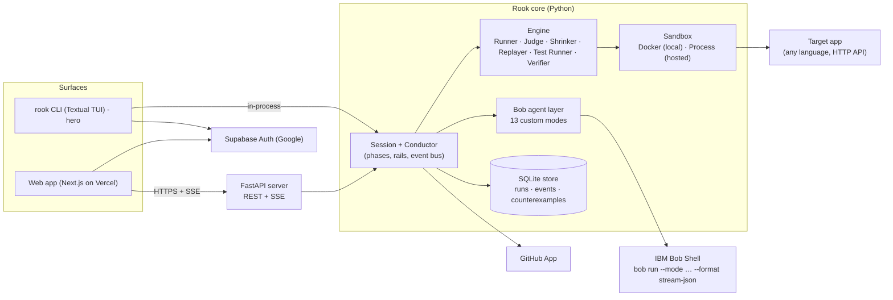

# 02 · Technical Architecture: Rook

> **Contracts in this doc are law.** Section 6 (the model schema), section 9 (events) and section 11 (API) are shared by the CLI, the server and the web app. Change them only by editing this doc in the same commit.

---

## 1. Overview



- **One core, two surfaces.** The CLI runs the core **in-process**. The web app talks to the **server**, which wraps the same core. Both render the **same event stream** (section 9).
- **Bob thinks, the engine proves.** Agents produce proposals (rules, actions, fixes). The engine executes and decides.

## 2. Tech stack

| Layer | Choice | Why |
|---|---|---|
| Core, engine, server | **Python 3.12**, `uv`, pydantic v2, httpx, FastAPI, uvicorn, sse-starlette, PyYAML, PyJWT | Fast to build, strong async HTTP, one language for the whole backend |
| CLI | **Typer** (commands) + **Textual** (interactive TUI) + Rich | Smooth truecolor animation, no flicker, widgets |
| Web | **Next.js 15** (App Router) + TypeScript strict + Tailwind v4, `@supabase/supabase-js`, vitest | A familiar layout and fast to build, hosted on Vercel |
| AI | **IBM Bob Shell 2.0.5** via `bob run` | Custom modes act as agents, with streamed JSON output |
| Storage | SQLite (stdlib `sqlite3`, WAL) | Zero ops. The same schema works locally and hosted |
| Sandbox | Docker CLI (local), subprocess (hosted allowlist) | Runs any repo locally; the hosted server runs demo apps as subprocesses (no Docker socket in the server container) |
| Auth | Supabase Auth (Google OAuth), GitHub App | Standard and quick |
| Hosting | Vercel (web), AWS EC2 + Docker Compose + Caddy (server + demo apps) | Vercel is free; one small EC2 host with automatic HTTPS on `<ip-dashes>.sslip.io` (Hugging Face Docker Spaces now need a paid plan) |

## 3. Repository layout

```
rook/                           # repo root (github.com/tony19053000/rook)
├─ CLAUDE.md  README.md  HANDOFF.md  STATUS.md
├─ docs/01_PRD.md … 05_FEATURE_TICKETS.md, docs/mockups/*.html
├─ .claude/agents/coder.md, reviewer.md
├─ pyproject.toml               # package "rook-cli", entry points: rook = rook.cli.main:app, rook-pr-comment (the Action's PR comment)
├─ action.yml                   # GitHub Action (composite): rook run --ci --auto, then one upserted PR comment with rook-report.md
├─ src/rook/
│  ├─ core/            session.py (Session, Conductor), workspace.py (PREPARE copy/clone/demo, SHIP git branch), rails.py, events.py (bus + models), config.py
│  ├─ agents/          bob.py (BobClient), registry.py (AgentSpec x12), prompts/*.md, schemas.py, modes.py (writes .bob/custom_modes.yaml), recorder.py, caller.py, coordinator.py, guide.py, understand.py (SCOUT → START_APP → MAP pipeline)
│  ├─ model/           schema.py (rook.yaml pydantic), expr.py (safe evaluator), loader.py
│  ├─ engine/          runner.py, generator.py, executor.py (HTTP), judge.py, shrinker.py, replayer.py, verifier.py, testrunner.py, isolation.py, dryrun.py (MAP dry-run)
│  ├─ sandbox/         base.py, docker.py, process.py, allowlist.py
│  ├─ store/           db.py (schema + migrations), repo.py (queries)
│  ├─ github/          app.py (JWT, installation tokens), repos.py, pr.py, pr_comment.py (Action: rook-report.md → one marked PR comment)
│  ├─ auth/            cli_login.py (localhost callback + device code), tokens.py, verify.py (Supabase JWT)
│  ├─ export/          counterexample.py (JSON), tests.py (native test via Bob + validation, fallback HTTP pytest)
│  ├─ server/          app.py (FastAPI), routes/*.py, sse.py, guest.py (quotas)
│  └─ cli/             main.py (Typer), tui/app.py (Textual), tui/widgets/*.py (AgentSprite, EngineRow, Question, Cards), logo.py
├─ tests/
│  ├─ fixtures/minishop/        # tiny in-repo FastAPI app with known bugs, used to test the engine (NOT a demo app)
│  └─ unit/ …, integration/ … (markers: docker, bob)
├─ web/                         # Next.js app
└─ deploy/                      # the hosted server (§14): Dockerfile, start.sh, docker-compose.yml, Caddyfile, smoke.py,
                                #   pack-bob.sh, vendor/ (gitignored Bob Shell), demos/ (allowlist, catalog, pinned repos),
                                #   aws/ (create, deploy, destroy, ssh, scripts/set-secret.sh, remote/set_env.py, user-data)
```

Files written into the **target repo** (committed by the user, like tests):
```
<target>/rook/rook.yaml                 # actions, state readers, rules (the "model"), human-approved
<target>/rook/counterexamples/cx_001.json
<target>/<native test path>/rook_cx_001.<ext>   # regression test, e.g. tests/rook_cx_001.test.js
```
Local user data lives in `~/.rook/` with `credentials.json` (chmod 600), `rook.db`, `workspaces/<run_id>/` and `recordings/`.

## 4. Session, phases and the Conductor

A **run** is one Session. The Conductor drives these phases and emits events (section 9):

```
PREPARE      clone/copy repo into ~/.rook/workspaces/<run>/ (git worktree for local folders), write .bob/custom_modes.yaml
SCOUT        agent scout        -> RepoSummary
START_APP    agent mechanic     -> SandboxPlan; engine starts the sandbox + health check  (loop ≤3 on failure; may ASK setup value)
MAP          agent mapper       -> actions + state (rook.yaml part); engine dry-runs each action once (loop ≤3)
             (agents/understand.py runs SCOUT..MAP; engine/dryrun.py decides pass/fail; writes <workspace>/rook/rook.yaml)
RULES        agent lawmaker     -> rules; engine sanity-checks (parse + holds on fresh app); agent rule_critic -> verdicts
             (agents/rules.py; engine/sanity.py: parses + known names/fields, then holds on a fresh app = the rule's
              entities just created, or its `when` action sent once, judged by the Judge on the rule's own check,
              never on the HTTP status; engine-rejected rules skip the critic; critic revisions are re-checked.
              A response rule whose check evaluates to false on that first request is NOT rejected: it is kept
              and flagged `already_broken` (a one-step bug or a wrong rule; the engine can't tell). The critic
              sees the flag. A check that fails to evaluate is still rejected; state rules are unchanged)
APPROVE      ASK approve_rules  (auto: accept critic-approved, never a rule flagged possibly already broken)
DESIGN       agents test_designer + strategist (parallel) -> scenarios, weights
SEARCH       engine runner+judge (background; chat allowed) until violation or budget
  └─ on violation: SHRINK -> REPLAY -> SAVE (json + native regression test written by surgeon in test-only scope, see §7.8)
DIAGNOSE     agent detective -> Diagnosis; agent diag_reviewer -> verdict (loop ≤3)
APPROVE_FIX  ASK fix
FIX          agent surgeon (only edit-capable agent) -> patch in workspace; agent fix_reviewer -> verdict (loop ≤3)
VERIFY       engine verifier: replay + project tests + fresh search  (fail -> back to DIAGNOSE, ≤3)
APPROVE_PR   ASK pr
SHIP         commit fix + regression test + rook/rook.yaml + cx JSON to a new branch rook/fix-<cx> (fix.committed);
             GitHub repos only: then push the branch + open a PR (ROOK-031, pr.opened). Test mode and local folders
             (LocalBranchShipper, the default) stop after the local commit: nothing is pushed, never the default branch.
DONE
```

**Session (`core/session.py`, ROOK-023).** Implementation notes and the API the CLI and server use:
- PREPARE (`core/workspace.py`): a local folder is **copied** (no `.git`, caches or `node_modules`) into
  `~/.rook/workspaces/<run>/` and gets a fresh git repo with one baseline commit, so the user's folder and its
  `.git` are never written to. GitHub: `git clone` with the installation token passed only through the git child
  env (`http.extraheader`), never argv or `.git/config`. Demo: allowlisted repos only; `hosted` refuses all else.
  Git runs with no user/system config and no hooks.
- In SAVE only the cx JSON is written and `counterexample.saved{test_path:null}` published. The native regression
  test is written after APPROVE_FIX (a Surgeon edit needs the human's OK, CLAUDE.md rule 5), at the start of FIX,
  and `counterexample.saved` is published again with its `test_path`.
- VERIFY fail -> Coordinator at `verify_failed` -> DIAGNOSE (rails: at most 3 verifications). Before re-diagnosing,
  the unverified patch is reverted (path-guard snapshot taken before FIX) and the app reloaded; the Detective is
  told what failed. If the rails end the loop, the last patch stays in the workspace, unshipped, and the summary
  says so.
- approve_rules payload: `{rules:[{id, text, kind, check, accepted, reason, critic: approve|reject|revise|null,
  already_broken: bool}]}` (every proposed rule, with its outcome; only `accepted` ones can be approved; a flagged
  rule's `reason` ends with the engine's reason).
- Auto answers: approve_rules = critic-approved rules, never one flagged `already_broken` (only a human may
  approve it); fix = yes only for a reviewed diagnosis; pr = yes (a branch,
  never the default branch); menu = the first allowed of retry/skip/extend/diagnose/report/stop. Setup values come
  from `options.setup_values` or the user, never auto.
- RunState and the Guide snapshot observe the bus synchronously (`EventBus.add_observer`). Live Bob calls go
  through `BudgetedClient`: refused once the budget/daily cap is spent, else capped with `--max-cost`.
- API: `Session(repo, request, options, bus=, store=, ...)`, `await run() -> RunResult`, `events(after)`,
  `answer(question_id, answer) -> bool`, `chat(text) -> bool`, `cancel()`, `pending_questions()`; `answer`,
  `chat`, `cancel` are thread-safe. Cancel kills Bob process groups, stops the search, waits for a sandbox that is
  still starting, then stops every sandbox. `read_run(store, id)` rebuilds state from stored events;
  `mark_interrupted(store)` fails runs left `running` by a dead process (runs are not resumed mid-phase).

**The Coordinator (AI) and the rails:**
- The Conductor has a **default path** (above). At **branch points** (an agent failed 3 times, the search budget ran out with no violation, verification failed, or the user sent a free-form request), it calls the **coordinator** agent with a compact state summary and the **allowed next steps** for the current phase. It gets back `{"next": <step>, "reason": str}`.
- **Rails** (`core/rails.py`) are code and cannot be overridden:
  - `next` must be in the allowed set, otherwise the default is used
  - no FIX without an answered "fix" question (or `--auto`)
  - no SHIP without `verify.done{verified:true}`
  - only engine events can mark `violation.found` or `verified`
  - at most 3 retries per agent per phase
  - a coin budget per run (default 1.5) and a hard cap per day on the hosted server
- The **Guide** agent runs **concurrently** whenever the user sends chat text. It gets a JSON snapshot of the run (phase, counters, recent events, last errors) and never changes run state.

## 5. Bob agent layer

### 5.1 BobClient (`agents/bob.py`)
```
argv = [BOB, "run", "--mode", slug, "--format", "stream-json", "--workspace", ws,
        "--max-turns", str(n), "--disable-mcp", "--trust", "--accept-license"]   # prompt passed via argv (last arg)
subprocess: stdin=DEVNULL (MANDATORY, else it hangs), cwd=workspace (MANDATORY: --trust only trusts the cwd, and workspace custom modes load only from a trusted folder), env adds BOB_API_KEY, PATH includes Node 24 bin, timeout per call
```
- It parses **NDJSON**:
  - `{"type":"message","role":"assistant","content":…}` chunks are concatenated
  - `{"type":"tool_use","tool_name":…,"parameters":…}` becomes `agent.progress` with a human detail (`read_file path` → `reading src/refunds.js`)
  - `{"type":"result","status","stats":{"session_costs","duration_ms"}}` ends the call and gives its cost
- **Output contract:** every agent must end with **one fenced ```json block** that matches its pydantic schema (`agents/schemas.py`). BobClient extracts the last JSON block and validates it. On an error, it re-prompts with the validation error, up to 3 times.
- **Recorder:** every call is stored in `~/.rook/recordings/<sha256(slug + "\0" + prompt)>.ndjson`. Callers must build deterministic prompts that include every input (file contents or a digest), so the same inputs give the same key. Volatile run data never reaches a prompt: the DIAGNOSE evidence shows app-assigned ids as `var[n]` aliases (their index in the replay's captured pool, as the steps' `refs` name them) and drops per-request and server start/stop log lines, masking timestamps, addresses, pids, temp paths and durations (the workspace path becomes `/workspace`), so a recording made in-process replays on the hosted uvicorn subprocess. `ROOK_BOB_MODE=live|record|replay` controls this. Replay emits the recorded stream with the original timing (max 3×) and marks `agent.finished.recorded=true`, and the UIs show a "recorded" tag.
- **Edit tape (Surgeon):** a stream alone does not change files, so in record mode the files an edit-capable call changed are also saved as `<key>.edits.json` (`{"format":1,"files":{path: text|null},"withheld":{path: kind}}`, null = deleted). In replay they are written back (never through a symlink) before the path guard runs (`agents/edit_tape.py`). The tape is written **after** the path guard: `files` holds only the changes it allowed, verbatim, and `withheld` holds only the paths of the rejected ones, never their content (it may hold a target-app secret). Replay writes a placeholder at each withheld path, so the guard rejects the round again.
- **Cost:** `cost.update` events come from the `session_costs` totals.

### 5.2 Modes file
`agents/modes.py` generates `<workspace>/.bob/custom_modes.yaml` from `registry.py`. The workspace's `.git/info/exclude` gets `.bob/` so it never reaches a PR. The format is Bob's custom-mode YAML:
```yaml
customModes:
  - slug: rook-scout
    name: Rook Scout
    description: …
    roleDefinition: …
    whenToUse: …
    customInstructions: …   # includes the JSON output contract
    groups: [read]          # surgeon: [read, [edit, {fileRegex: "<approved paths>", description: "fix files"}]]
```
Bob checks `fileRegex` against the path its edit tool received, and those tools take **absolute** paths. So the Surgeon's regex is `^(?:<escaped absolute workspace>/)?(?:<escaped path>|…)$`: each approved file matches, relative or absolute, and nothing else does.
Tool groups are the **real permission boundary**, because `bob run` pre-approves every tool call that's allowed.

### 5.3 The 13 agents (Coordinator + 12 specialists)

| Slug | Character | Group | Input | Output schema (key fields) | Tools |
|---|---|---|---|---|---|
| `rook-coordinator` | Coordinator | control | state summary, allowed steps | `{next, reason}` | read |
| `rook-scout` | Scout | analyzer | workspace | `RepoSummary{language, framework, entrypoints[], routes_files[], models_files[], test_command, run_hints, business_summary}` | read |
| `rook-strategist` | Strategist | analyzer | rules, actions, search stats | `{weights:{action:float}, focus[], reason}` | read |
| `rook-detective` | Detective | analyzer | rule, minimal steps, per-step state, logs, code | `Diagnosis{file, line, explanation, evidence[]}` | read |
| `rook-mechanic` | Mechanic | maker | summary, Docker/compose/manifests, error logs | `SandboxPlan{mode: compose\|dockerfile\|command, build, start, port, health_path, env_required[], env_defaults{}}` | read, edit(`^\.rook-sandbox/`) |
| `rook-mapper` | Mapper | maker | summary, route/model files | `{actors[], actions[], state[]}` (section 6) | read |
| `rook-lawmaker` | Lawmaker | maker | model files, validation, tests, docs, actions/state | `{rules[]}` with `evidence` | read |
| `rook-test-designer` | Test Designer | maker | rules, actions | `{scenarios:[{name, rule_id, steps[]}]}` | read |
| `rook-surgeon` | Surgeon | maker | diagnosis, code, counterexample | patch applied in workspace + `{files[], summary}` | read, **edit (only the files in the diagnosis plus tests)** |
| `rook-rule-critic` | Rule Critic | reviewer | proposed rules + evidence | `{verdicts:[{rule_id, verdict: approve\|reject\|revise, reason, revised?}]}` | read |
| `rook-diag-reviewer` | Diagnosis Reviewer | reviewer | diagnosis + raw evidence | `{verdict, reason}` | read |
| `rook-fix-reviewer` | Fix Reviewer | reviewer | diff, diagnosis, rules | `{verdict, issues[]}` | read |
| `rook-guide` | Guide | helper | run snapshot + question | `{answer}` | read |

The regression test is written by the **Surgeon** in a separate, test-only call (edit limited to the test path) **before** the fix, and the engine checks that it **fails**. After the fix, it must **pass** (see section 7.8).

## 6. The model: `rook/rook.yaml` (CONTRACT)

Written by the Mapper and Lawmaker, validated by `model/schema.py`, and approved by the human.

```yaml
version: 1
app:
  base_url: "{{sandbox.base_url}}"          # injected at runtime
  health: {method: GET, path: /health, expect_status: 200}
  isolation: fresh_entities                  # fresh_entities | restart
actors:
  - name: customer
    setup:                                   # run at sequence start to create a fresh actor
      - {method: POST, path: /auth/signup, json: {email: "{{fresh.email}}", password: "pw-{{fresh.id}}"}}
      - {method: POST, path: /auth/login,  json: {email: "{{fresh.email}}", password: "pw-{{fresh.id}}"},
         capture: {token: "$.token"}}
    auth: {header: Authorization, value: "Bearer {{actor.token}}"}
  - name: admin
    setup: [{method: POST, path: /auth/login, json: {email: admin@demo.local, password: "{{env.ADMIN_PASSWORD}}"}, capture: {token: "$.token"}}]
    auth: {header: Authorization, value: "Bearer {{actor.token}}"}
actions:
  - name: buy
    actor: customer
    request: {method: POST, path: /orders, json: {product_id: "{{ref.product_id}}", price: "{{p.price}}"}}
    params: {price: {int: [1, 500], edges: [1, 100, 500]}}
    requires: [product_id]                   # captured vars that must exist
    capture: {order_id: "$.id"}              # appended to the sequence's var pool (lists allowed)
    weight: 1.0
  - name: refund
    actor: customer
    request: {method: POST, path: "/orders/{{ref.order_id}}/refunds", json: {amount: "{{p.amount}}"}}
    params: {amount: {int: [1, 500], edges: [1, 50, 60, 100]}}
    requires: [order_id]
state:
  - name: order                              # entity reader
    each: order_id                           # evaluated for every captured order_id
    request: {method: GET, path: "/orders/{{order_id}}", actor: admin}
    fields: {paid: "$.paid", refunded: "$.refunded_total", status: "$.status"}
  - name: product
    each: product_id
    request: {method: GET, path: "/products/{{product_id}}", actor: admin}
    fields: {stock: "$.stock"}
rules:
  - id: refund_le_paid
    text: "Total refunds never exceed the amount paid"
    kind: state                              # state | response
    scope: order                             # a state entity name, or "global"
    check: "order.refunded <= order.paid"
    evidence: ["src/refunds.js:42 validates each refund alone", "README: Refunds section"]
    status: approved                         # proposed | approved | rejected
  - id: admin_export_forbidden
    text: "A normal user never opens the admin export"
    kind: response
    when: {action: admin_export, actor: customer}
    check: "response.status in (401, 403)"
    status: approved
```

**Templates:** `{{p.x}}` is a generated param, `{{ref.v}}` picks a captured var (a random earlier value), `{{fresh.*}}` is a unique per-sequence value, `{{env.X}}` comes from the sandbox env, and `{{actor.token}}` is the current actor's token.
**Concurrency:** a sequence step may be `{parallel: [step, step]}`. Its steps are sent concurrently (to catch races like the last item selling twice). The generator emits a group (10% of entity-touching steps) of an action plus a partner that requires one of the same vars. Every sub-step's `requires` must be met by *earlier* steps (never by a sibling), or the whole group is skipped; the runner pins all sub-steps to the same entity; captures are applied after all sub-steps finish, in sub-step order; the Judge runs once after the whole group; and the group is one entry of the trace (`step_index` counts groups).

### 6.1 Safe expression evaluator (`model/expr.py`)
- It parses with `ast.parse(mode="eval")`. Allowed nodes: `Expression, BoolOp, BinOp(+ - * / // %), UnaryOp(not, -), Compare (all ops incl. in / not in), Name, Constant, Tuple, List, Attribute` (reading dict keys only), `Subscript, Call, GeneratorExp, comprehension`.
- Allowed calls: `sum len min max abs all any round`.
- Names come only from the evaluation context (the entity dicts, `response`, `global`).
- No dunder attributes, no other calls, no assignment. The expression length is capped at 500 characters. **It never uses `eval` or `exec`.**

## 7. Engine (deterministic)

### 7.1 Runner and generator
- `Runner(model, sandbox, seed, budget)` produces `Sequence = list[Step]`, where `Step = {action, actor, params, parallel?}`.
- Generation is a random walk with a `random.Random(f"{seed}:{i}")` per sequence (so seeds never overlap), and the generator fixes each step's actor and params. At each step it picks among actions whose `requires` are satisfied, weighted by `action.weight × strategist weight`. Params are drawn from the range, with a **30% chance** of an edge value. `ref` picks from the var pool. The length is 1–12 (the default max is 12).
- **Designed scenarios** from the Test Designer are run first, then mutated (insert/delete/duplicate a step, jitter params) and mixed in at 20%.
- **DESIGN inputs are checked by the engine** (`engine/scenarios.py`, used by `agents/design.py`, which calls both agents in parallel). A scenario is kept only if it targets an approved rule and every step names a known action and actor, uses only declared params whose values fit their spec (int range, choice, string values/pattern), and needs only refs captured by *earlier* steps (not by a parallel sibling); caps: 20 scenarios, 12 steps, 4 sub-steps per parallel group. Dropped scenarios are logged with the reason. Strategist weights keep only known actions with finite values ≥ 0, capped at 10; a set that would leave no ref-free action to start a sequence (e.g. all zero) is ignored. The runner makes the order visible with `log` events: `Designed scenario k/n: <name> (rule <id>)` as each starts, `All n designed scenarios started; random sequences follow`, and `Found by designed scenario …` / `Found by generated sequence …` on a violation; the runner's `engine.started` label adds `, n designed scenarios first`.
- Execution goes through `executor.py` (an async `httpx` client). Each sequence gets **fresh actors** and a fresh var pool.
- **Speed:** async, with N concurrent sequences (default 16, isolated by fresh entities). The state is read only for entities touched by the step (ids it referenced or captured). Actors whose setup uses no `fresh` value (e.g. an admin login) are set up once and shared. With an explicit (in-process) transport the executor calls it directly, bypassing the httpx client layers.

### 7.2 Judge
After **every step**, it evaluates the rules in scope: state rules for the touched entities (and global ones), and response rules for matching actions. It returns `Violation{rule_id, step_index, entity, observed, expected_expr}` on the first failure. The Judge is the **only** component that can emit `violation.found`.

### 7.3 Isolation
- `fresh_entities` (default) creates new actors and entities per sequence, so there's no global reset and it's fast. Rules must be scoped to entities that the sequence created.
- `restart` restarts the sandbox with a fresh DB volume or temp file. It's slow and used only for replay and verification when the model demands it.

### 7.4 Shrinker
1. **Step shrinking:** ddmin (delta debugging) over the step list. Each candidate is re-executed **for real** on fresh entities. It keeps candidates that still break the **same rule**, and removes steps whose `requires` became unsatisfied (a repair pass).
2. **Value shrinking:** move each param toward its smallest or edge value while the failure persists.
3. It emits `shrink.step{steps_count}` on every improvement. The result is 1-minimal (removing any single step no longer fails).

### 7.5 Replayer
It runs the exact sequence N times (default 10) with fresh entities and reports `k/N`. If k < N, it's marked `flaky` (expected for races).

### 7.6 Test Runner
It runs the project's own test command (from `RepoSummary.test_command`, confirmed by the Mechanic) inside the sandbox and records the exit code and a summary.

### 7.7 Verifier
Verification passes only if all of these hold:
1. The exact counterexample now holds the rule (N/N).
2. The project's tests pass.
3. The native regression test passes.
4. A fresh search of `verify_budget` sequences (default 20,000 or 120 s, whichever comes first) with a new seed finds **no violation** of any approved rule.

### 7.8 Regression test export
It writes `rook/counterexamples/cx_NNN.json`, which holds the steps, rule, observed and expected values, the seed and the model hash. It asks the Surgeon (test-only edit scope) to write a **native** test in the repo's framework. The engine runs it **before the fix and it must fail**. If it can't validate the test, it falls back to a generated HTTP-level pytest file that replays the JSON.
- (`agents/fix.py`, `engine/pathguard.py`) Rook picks the native test's path: next to the project's existing tests of the same language, or next to the diagnosed file for Go. The test-only call may create only that file. The engine runs it with the project's test command plus that path, and accepts it only on **exit code 1 with no errors**. If the test passes, errors, can't be run, or the call touched other paths, the test is removed and the fallback is used (`log` warn with the reason). The phase ends with `counterexample.saved{test_path}`.
- The fix call may edit **only the diagnosed file**. The accepted regression test is frozen, because it proved the bug by failing. After every Surgeon call, the **path guard** compares the workspace with a snapshot taken just before the call (hash plus backup per file, walked without following symlinks). It reverts every added, modified or deleted path outside the allowlist, any symlink, any change under `.git/`, `.bob/` or `rook/`, and any NFKC/case-fold lookalike of an allowed path. The round is then rejected with the reason. A rejected round (by the guard or the Fix Reviewer) is fully reverted. Only a Fix Reviewer approval keeps the patch and emits `fix.ready`. The FIX phase refuses to start unless the rails allow `fix`.

## 8. Sandbox

`Sandbox` interface: `start(plan) -> base_url`, `stop()`, `restart()`, `exec(cmd) -> result`, `logs(tail)`.
- **DockerSandbox** (local CLI): uses `docker compose` or `docker build/run` from the SandboxPlan, inside a dedicated network. No host mounts except the workspace copy. There are CPU and memory limits, and a random published port on `127.0.0.1` only.
- **ProcessSandbox** (hosted server): only for **allowlisted demo repos** (`sandbox/allowlist.py`), which are pre-installed in the image. It starts the app as a subprocess on a free port with a temp database per run, and gets killed when the run ends. `exec` runs only the entry's named `commands` (e.g. `test`), capped at the entry's `command_timeout`, with the app's scrubbed env plus offline settings.
  - **Where it runs from (ROOK-039c).** By default the pristine `app_dir`. With `workspace=` (granted by the server only when `ROOK_BOB_MODE=replay`, and used by the Session only while its Bob client replays) the app and its commands run from the run's workspace copy, and the `test` command may get one extra argument: the regression test file's path inside the workspace. The Session then uses the entry's `test` command as the project test command (never the Scout's guess), so FIX validates the native test and VERIFY runs the patched app, the native test and the project tests. Rules and reasons: 03 §3.
  - **Live mode on the server:** the app always runs from `app_dir`, so a fix can't be verified there. After FIX the Session skips VERIFY and ends `done` with a summary that says the fix was written to the workspace but NOT verified, and to use the CLI.
- Health check: poll `health` until it returns 200, with a 60 s timeout.

## 9. Event stream (CONTRACT)

Envelope, one JSON object per event:
```json
{"v":1, "seq": 42, "ts": "2026-09-26T08:10:00.123Z", "run_id": "r_8f2c", "type": "agent.started", "data": {…}}
```
`seq` increases strictly per run. Clients resume with `?after=<seq>`.

| type | data |
|---|---|
| `run.created` | `{repo:{kind,ref,name}, request, options:{auto,budget}}` |
| `run.phase` | `{phase}` (section 4 names) |
| `agent.started` | `{agent, call_id, detail}` where `agent` is the agent id with underscores (e.g. `scout`, `rule_critic`; Bob mode slug is `rook-` + id with hyphens) |
| `agent.progress` | `{agent, call_id, detail}` |
| `agent.finished` | `{agent, call_id, ok, summary, cost, recorded}` |
| `engine.started` | `{worker, label}` where worker is one of `runner judge shrinker replayer testrunner verifier` |
| `engine.progress` | `{worker, pct, label, count?}` (throttled to 5/s) |
| `engine.finished` | `{worker, ok, summary}` |
| `question.asked` | `{question_id, kind: approve_rules\|fix\|pr\|setup_value\|menu\|repo, text, options:[{id,label}], payload}` |
| `question.answered` | `{question_id, answer, by: user\|auto}` |
| `repo.summary` | `RepoSummary` |
| `sandbox.ready` | `{base_url_redacted, mode}` |
| `model.actions` | `{actors[], actions[], state[]}` |
| `rules.proposed` | `{rules[]}` |
| `rules.reviewed` | `{verdicts[]}`, each `{rule_id, verdict: approve\|reject\|revise, reason, by: engine\|critic, revised?, already_broken?}` (`already_broken: true` only on the critic verdict of a flagged rule) |
| `rules.approved` | `{rule_ids[]}` |
| `search.progress` | `{sequences, per_sec, rules:{rule_id: holding\|broken}}` (throttled to 5/s) |
| `violation.found` | `{violation_id, rule_id, steps_count, observed}` |
| `shrink.step` | `{violation_id, steps_count}` |
| `counterexample.saved` | `{cx_id, rule_id, rule_text, steps[], observed, expected, reproduced:"10/10", flaky, test_path}` |
| `diagnosis.ready` | `{cx_id, file, line, explanation, reviewed:bool}` |
| `fix.ready` | `{cx_id, files[], diff, reviewed:bool}` |
| `verify.step` | `{cx_id, check: replay\|project_tests\|regression_test\|fresh_search, status: running\|passed\|failed, detail}` |
| `verify.done` | `{cx_id, verified, summary}` |
| `fix.committed` | `{cx_id, branch, commit, files[]}` (SHIP: the verified fix committed to a new branch; not pushed yet) |
| `pr.opened` | `{url, number, branch}` |
| `chat.message` | `{role: user\|guide, text}` |
| `cost.update` | `{coins_total}` |
| `log` | `{level: info\|warn\|error, text}` |
| `run.finished` | `{status: done\|failed\|cancelled, summary}` |

## 10. Storage (SQLite)

```sql
runs(id TEXT PK, user_id TEXT, repo_kind TEXT, repo_ref TEXT, status TEXT, created_at TEXT, finished_at TEXT, coins REAL)
events(run_id TEXT, seq INTEGER, ts TEXT, type TEXT, data TEXT, PRIMARY KEY(run_id, seq))
counterexamples(id TEXT PK, run_id TEXT, rule_id TEXT, json TEXT, status TEXT)   -- id = <run_id>_<cx_id>; open|fixed|verified
users(id TEXT PK, email TEXT, github_installation_id INTEGER, created_at TEXT)
guest_quota(key TEXT PK, day TEXT, runs INTEGER, coins REAL)
```

## 11. Server API (CONTRACT), base `/api/v1`

| Method | Path | Auth | Body → Response |
|---|---|---|---|
| GET | `/health` | none | → `{ok, version, bob_mode, proxied}` (`proxied`: the request carried the web proxy's `ROOK_PROXY_SECRET` header, 03 §8) |
| GET | `/me` | user | → `{id, email, github_connected}` |
| GET | `/repos` | user or guest | → `[{kind: github\|demo, ref, name, private, language}]` (guests only see demo repos) |
| POST | `/runs` | user or guest | `{repo:{kind,ref}, request, options:{auto?:bool}}` → `{run_id}` (guest: demo repos only, quota) |
| GET | `/runs` | user or guest | → `[{id, repo, status, created_at, headline}]` |
| GET | `/runs/{id}` | owner | → `{run, counterexamples[]}` |
| GET | `/runs/{id}/events?after=N` | owner | → **SSE** `text/event-stream`, each `data:` is one envelope |
| POST | `/runs/{id}/answers` | owner | `{question_id, answer}` → `{ok}` |
| POST | `/runs/{id}/chat` | owner | `{text}` → `{ok}` (the answer arrives as events) |
| POST | `/runs/{id}/cancel` | owner | → `{ok}` |
| POST | `/counterexamples/{id}/replay` | owner | → `{run_id}` |
| GET | `/auth/cli/start?port=P&state=S` | none | redirects to Supabase Google OAuth |
| GET | `/auth/cli/callback` | none | redirects to `http://127.0.0.1:P/cb?token=…&refresh_token=…&expires_at=…&state=S` (or `?error=sign_in_failed&state=S`); for a device sign-in, an HTML "signed in" page |
| POST | `/auth/device/start` · `/auth/device/poll` | none | device-code flow |
| GET | `/auth/device/verify?code=C[&confirm=1]` | none | the device-code page: a confirmation page, then (`confirm=1`) Google OAuth |
| POST | `/auth/logout` | user | revokes the caller's Supabase session → `{ok}` |
| GET | `/github/install-url` | user | → `{url}` |
| GET | `/github/callback` | user | stores the `installation_id` |
| POST | `/github/token` | user | → a short-lived installation token for the CLI (scoped to the user's installation) |
| POST | `/github/webhook` | signature | installation events |

**Auth:** `Authorization: Bearer <Supabase JWT>` (the web app and the CLI), or a `rook_guest` signed cookie. Every run route checks the owner.

**Pinned shapes and behaviour (ROOK-029, `server/`):**
- **Callers.** A bearer token that fails verification is a 401, even with a guest cookie. With no bearer token, a valid
  `rook_guest` cookie makes the caller a guest; the "user or guest" routes issue a new cookie when it is missing
  (httpOnly, SameSite=Lax, Secure, 30 days, value `<guest_id>.<HMAC-SHA256>`). `/me` and `/github/*` need a user
  (401 for a guest).
- **Repos and runs.** The hosted server runs **only allowlisted demo repos** (03 §3), for users and guests alike:
  `POST /runs` takes `repo.kind: demo` with a `ref` from the demo catalog; `github` (and any unknown demo `ref`) is a
  403 whose `detail` says to run arbitrary repos with the CLI. `request` is at most 2000 chars; `options` has only
  `auto`. `GET /repos` lists the demo catalog, plus the user's GitHub repos once ROOK-031 is in.
- **Run status:** `queued | running | done | failed | cancelled`. At most 3 runs execute at once; later runs wait as
  `queued` (a bounded queue; when it is full, 429).
- **`RunSummary`** (each item of `GET /runs`, newest first, at most 50, and `run` in `GET /runs/{id}`):
  `{id, repo:{kind, ref, name}, status, created_at, finished_at: str|null, headline, result: broken|fixed|null,
  coins, last_seq}`. `headline` is the run's request (or the repo name when empty), at most 120 chars; `result` is
  `broken` when a counterexample is still open, `fixed` when every one is fixed or verified, else `null`.
- **`counterexamples[]`** in `GET /runs/{id}`: the stored counterexample JSON (§7.8 export: `cx_id, rule, steps,
  violated_at_step, observed, expected, reproduced, flaky, seed, model_hash, created_at`) plus `{id, status:
  open|fixed|verified, rule_id, rule_text}`; `id` is `<run_id>_<cx_id>`, the id `POST /counterexamples/{id}/replay`
  takes.
- **`{ok}`** is `{ok: true}` when accepted and `{ok: false}` when not: the question is not open or the answer has the
  wrong shape, chat on a run that is not live, cancel on a finished run. `answers` body: `{question_id: str (≤100),
  answer: any}`; `chat` body: `{text: str (1-2000)}`.
- **`POST /counterexamples/{id}/replay`** answers 501 until the Session supports a replay-only run.
- **SSE** (`/runs/{id}/events?after=N`, `N` an integer ≥ 0, default 0): each message is `id: <seq>` plus one
  `data: <envelope JSON>` line (§9); a `: ping` comment every 15 s; the stream ends after `run.finished`. A
  `: flush` comment follows each burst of events once the stream has been quiet for 0.25 s: the Vercel rewrite
  proxy holds back the tail of a burst until the next bytes arrive (measured: a 3 KB `question.asked` waited for the
  next ping, 15 s), and this small separate write pushes it through. Clients ignore comments. For a
  finished run it sends the stored events after `N` and ends. The owner is re-checked on every connect.
- **Errors** are `{detail: str}` and never echo the request: 400 invalid input, 401 bad or missing auth, 403 not
  allowed (guest or non-demo repo), 404 missing run **or not the owner**, 413 body over 64 KB, 429 rate limit /
  guest quota / queue full / daily coin cap (with `Retry-After`), 501 not available yet.
- **Sign-in (ROOK-030, `server/supabase.py`, `server/logins.py`, `routes/auth.py`).** A bearer token is a Supabase
  access token. `SUPABASE_URL` turns verification on: `alg` HS256 is checked with `SUPABASE_JWT_SECRET` (refused
  when it is unset), ES256 / RS256 with the key of that `kid` from `<SUPABASE_URL>/auth/v1/.well-known/jwks.json`
  (cached 10 min; an unknown `kid` refetches at most every 30 s; the key type must match the `alg`); any other
  `alg` (and `none`) is refused, and `jku`/`x5u`/`jwk` headers are ignored. Required claims: `exp` (10 s leeway),
  `sub`, `aud = "authenticated"`, `iss = <SUPABASE_URL>/auth/v1`. The user id is `sub`; `/me` returns its `email`.
  The CLI routes also need `SUPABASE_ANON_KEY` (the public key, sent as `apikey`) and `ROOK_PUBLIC_URL`, else they
  answer 501. Both flows use Supabase OAuth with **PKCE**: the server keeps the code verifier and sets a signed,
  httpOnly `rook_login` cookie (path `/api/v1/auth`, 10 min) that points at the pending flow, and `redirect_to` is
  exactly `<ROOK_PUBLIC_URL>/api/v1/auth/cli/callback` (it must be in the Supabase redirect allowlist). The
  callback consumes the flow once and exchanges the code (`POST <SUPABASE_URL>/auth/v1/token?grant_type=pkce`).
  `start`: `port` 1024-65535, `state` 16-128 chars of `[A-Za-z0-9_-]`. `POST /auth/device/start` →
  `{device_code, user_code: "ABCD-EFGH", verification_url, expires_in: 600, interval: 5}`; `POST /auth/device/poll`
  `{device_code}` → `{status: pending}` | `{status: done, token, refresh_token, expires_at}` (once) |
  `{status: expired}`. A user code starts one sign-in. At most 1000 flows and 1000 device codes are pending
  (in memory, one process; 429 beyond).
- **Web access** goes through a same-origin Vercel rewrite (`/api/v1/*` → the EC2 server), so the guest cookie is
  first-party. The web middleware adds the `X-Rook-Proxy-Secret` header (`ROOK_PROXY_SECRET`) to these requests, so
  the server can trust the client IP Vercel forwards (03 §8). CORS still allows only the configured web origins (never `*`), with credentials and the
  `Authorization` and `Content-Type` headers.

## 12. CLI architecture

- `rook` (no args) starts the **Textual app**. Other subcommands come from Typer.
- The TUI subscribes to the Session's event bus and renders:
  - `AgentSprite` widget: a 12×10 pixel sprite drawn with half-block characters `▀▄` in truecolor, which bounces, blinks and glances
  - `AgentRow`, which collapses into a one-line summary when finished
  - `EngineRow`: `■` plus a progress bar
  - `QuestionPrompt`: y/n/e and menus navigated with the arrow keys
  - `CounterexampleCard`
  - a status bar and an input box
- The chat input stays active while the search runs, and messages go to the Guide.
- The engine runs in a worker thread with its own asyncio loop. Events are posted to Textual with `loop.call_soon_threadsafe` on the app loop captured at bind time (non-blocking; `call_from_thread` can hang once the app has quit).
- Frame rate is 12 fps, and the sprite is static when `NO_MOTION` is set or reduced motion is on.

## 13. Web architecture

- Next.js App Router with these pages: `/` (home and composer), `/runs/[id]` (the chat column with cards), `/login`.
- `lib/events.ts` holds TS types that mirror section 9, and `lib/sse.ts` handles reconnecting to the SSE stream with `after`.
- `lib/session.ts`: Google sign-in with `@supabase/auth-js` (PKCE, `detectSessionInUrl: false`, storage key `rook-auth`, only the `apikey` header: the `sb_publishable_…` key is never a bearer). `/login` starts `signInWithOAuth` with `redirectTo = <origin>/login` and, back from Google, exchanges `?code=` once and goes to `/`. `getToken()` returns the (auto-refreshed) access token for `Authorization: Bearer`, or null for a guest. `useSession` is the guest until Supabase reports a user, then checks `GET /me` (a 401 signs the browser out). Sign-out is local to the browser (`scope: local`). Without `NEXT_PUBLIC_SUPABASE_URL` / `NEXT_PUBLIC_SUPABASE_ANON_KEY` at build time the site is guest-only.
- `lib/runStore.ts` is a reducer from events to UI state, the **same logic** as the TUI.
- Components: `AgentSprite` (a canvas that ports the sprite shapes), `AgentRow`, `EngineRow`, `QuestionCard`, `RulesCard`, `SearchCard`, `CounterexampleCard`, `FixCard`, `VerifyCard`, `Sidebar`, `Composer`, `RepoPicker`.
- **`middleware.ts`** (03 §8): on `/api/*` it replaces any client-sent `X-Rook-Proxy-Secret` with `ROOK_PROXY_SECRET` (a server-only env var; unset = no header) before the rewrite; on pages it sets a per-request nonce Content-Security-Policy (`lib/security.ts`), which Next.js puts on its scripts. So every page renders per request (`dynamic = "force-dynamic"` in the root layout). Static security headers come from `next.config.ts` `headers()`. `e2e/console.mjs <origin> [--run]` loads the pages in headless Chrome and fails on any console error, CSP violation or failed request.
- The browser calls the API **same-origin** through a Vercel rewrite (`/api/v1/*` → the EC2 server behind Caddy, a proxy, not a function), so the `rook_guest` cookie stays first-party (SameSite=Lax). The rewrite target is `ROOK_API_PROXY_TARGET` (the server origin, read at build time; no rewrite when unset). `NEXT_PUBLIC_API_URL` is the base the client uses: unset in production (the browser then calls same-origin `/api/v1`), the server URL in local dev without the proxy.

## 14. Deployment

| Piece | Where | Notes |
|---|---|---|
| Web | Vercel project `rook`, <https://rook-weld-six.vercel.app> (Git-connected: every push to `main` redeploys) | env: `ROOK_API_PROXY_TARGET` = the server origin, e.g. `https://203-0-113-7.sslip.io` (public; build-time: it sets the `/api/v1/*` rewrite, so set it before the build and redeploy after changing it; origin only, no path), `NEXT_PUBLIC_SUPABASE_URL`, `NEXT_PUBLIC_SUPABASE_ANON_KEY` (public), and **`ROOK_PROXY_SECRET`** (a secret: mark it Sensitive, never `NEXT_PUBLIC_`; read at runtime by the middleware only; the same value as on the server, at least 32 chars, e.g. `openssl rand -hex 32`). `NEXT_PUBLIC_API_URL` stays **unset** on Vercel so the browser uses same-origin `/api/v1` through the rewrite. The server's `ROOK_WEB_ORIGINS` should list the Vercel origin (CORS for direct calls). Check the secret end to end with `curl https://<web>/api/v1/health` → `"proxied": true` |
| Server | AWS EC2 (`us-west-2`, one `t3.small`, Ubuntu 24.04, 30 GB gp3, IMDSv2, Elastic IP), `deploy/docker-compose.yml` | Two containers. **caddy** (`caddy:2.11.4-alpine`, ports 80/443) gets a Let's Encrypt certificate for `ROOK_HOST` = `<ip-dashes>.sslip.io` and proxies only `/api/v1/*` (SSE unbuffered, `flush_interval -1`). **rook** (`deploy/Dockerfile`: Python 3.12 + uv, Node 22, Go, optional Bob Shell 2.0.5 on Node 24, non-root user `rook`, tini, `uvicorn rook.server.app:app --port 8000`) is not published: only Caddy reaches it. The database and workspaces live on the `rook-data` volume (`ROOK_DB_PATH=/data/rook.db`, `ROOK_WORKSPACES=/data/workspaces`). `ROOK_BOB_MODE` defaults to `replay` |
| Server config | `deploy/.env` on the host (non-secret, written by `deploy/aws/deploy.sh`) | `ROOK_HOST`, `ROOK_WEB_ORIGINS`, `ROOK_BOB_MODE`, `ROOK_DAILY_COIN_CAP` (default 2). Fixed in the compose file: `ROOK_PUBLIC_URL=https://${ROOK_HOST}` (the `rook login` OAuth callback); `ROOK_TRUSTED_PROXY_HOPS=2` (browser → Vercel → Caddy → rook: Vercel overwrites `X-Forwarded-For` with the client IP and Caddy, which trusts every peer because Vercel has no fixed egress IPs, appends Vercel's IP, so the client is the 2nd entry from the right). In the image: `ROOK_ALLOWLIST=/opt/rook/config/allowlist.yaml`, `ROOK_DEMO_REPOS=/opt/rook/config/demos.yaml` (from `deploy/demos/`) |
| Server secrets | `/etc/rook/rook.env` on the host only (root, `600`), compose `env_file` | Set one at a time with `deploy/aws/scripts/set-secret.sh NAME` (value over ssh stdin; allowlist: `BOB_API_KEY`, `ROOK_GUEST_SECRET`, `ROOK_PROXY_SECRET`, `SUPABASE_JWT_SECRET`, `SUPABASE_URL`, `SUPABASE_ANON_KEY` (public, but kept with the Supabase settings), `GITHUB_APP_ID`, `GITHUB_APP_PRIVATE_KEY`, `GITHUB_WEBHOOK_SECRET`). Never in the image, the repo, user-data or argv. `deploy.sh` generates `ROOK_GUEST_SECRET` on the host when it is missing. The server process sees `GITHUB_APP_PRIVATE_KEY` as the PEM with **real newlines** (it is stored `\n`-escaped in double quotes, which compose expands) |
| Demo apps | `deploy/demos/` baked into the image | `repos.txt` lists the demo repos (`owner/name`, pinned 40-char SHA, https URL, build recipe `none/npm/go/uv`), cloned and pre-built by `build-demos.sh` into `/opt/rook/demos/<name>`; each needs matching entries in `allowlist.yaml` and `demos.yaml`. Interim demo until ROOK-039: `rook-demo/minishop` (the `tests/fixtures/minishop` app, pseudo-SHA `sha1("rook-demo-minishop")`) with its Bob recordings in `/home/rook/.rook/recordings` for replay. An entry may name its native test command (`commands: {test: [...]}`, `command_timeout`), run only in replay mode from the workspace copy (§8); the image installs the `sandbox` dependency group (pytest, pytest-asyncio) for the minishop and fallback regression tests |
| Bob Shell | `deploy/vendor/bobshell-2.0.5.tgz` (gitignored, packed by `deploy/pack-bob.sh`) | Never committed (licence unknown). Without it the image builds replay-only and `start.sh` refuses `live`/`record` mode; `live` also needs `BOB_API_KEY` |
| Uptime | none needed | EC2 does not sleep, so there is no keep-alive job. Optional: any external uptime monitor on `https://<host>/api/v1/health` (rate-limit exempt) |
| CLI | PyPI `rook-cli` | `uv tool install rook-cli` |

Runbook: `deploy/README.md` (pack Bob → `create.sh` → `deploy.sh` → `set-secret.sh` → verify with `deploy/smoke.py`).

## 15. Testing strategy

- **Unit:** the expression evaluator, schema validation, the generator's determinism, ddmin, templating, the event bus, rails, BobClient parsing (against recorded NDJSON fixtures) and the API routes (with a FastAPI TestClient).
- **Engine integration (default suite):** against `tests/fixtures/minishop`, served **in-process** with `httpx.ASGITransport` (fast, no network). The engine must find the refund bug, shrink it to 3 steps, replay it 10/10, and verify after the fixture is patched.
- **Marked suites:** `-m docker` (DockerSandbox on the fixture), `-m bob` (live Bob calls, which cost coins, so run them manually).
- **Web:** vitest for the event reducer and components, plus `tsc --noEmit`.

## 16. Failure modes

| Failure | Behaviour |
|---|---|
| Bob returns invalid JSON | Retry with the error (up to 3), then the Coordinator decides, then tell the user |
| The app won't start | The Mechanic loops up to 3 times with the logs, then ASK setup_value or show a clear error |
| An action dry-run fails | Back to the Mapper with the HTTP response (up to 3). If it still fails, the action is disabled |
| A rule doesn't hold on a fresh app | The rule is rejected automatically as "wrong rule" before the human sees it. Exception: a response rule broken by the very first request is kept, flagged `already_broken`; a human may approve it, auto mode never does |
| No violation within budget | Report "no counterexample in N sequences". The Coordinator may extend the budget once |
| A flaky counterexample | It's shown as `k/10 · flaky` and still reported. Races are expected to be flaky |
| Verification fails | Back to DIAGNOSE with the new evidence (up to 3), then report honestly |
| Bob is out of coins or hits the cap | Switch to recorded mode (labeled) or stop the AI phases. The engine still works |
